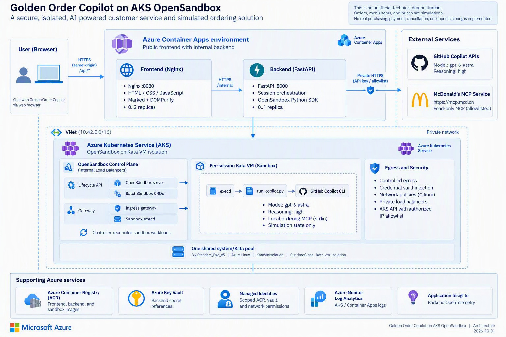

# Golden Order Copilot on AKS OpenSandbox

**English** | [简体中文](README.zh.md)



A proof-of-concept customer-service and simulated-ordering application. A web frontend
calls an internal FastAPI backend, which runs GitHub Copilot CLI in a separate
OpenSandbox **Kata VM for each browser session** on Azure Kubernetes Service (AKS).
The agent uses `gpt-6-astra`, a read-only remote McDonald's MCP service, and local
simulation-only ordering tools.

> This is an unofficial technical demonstration, not an official or endorsed
> McDonald's service. Orders, menu items, and prices from the local tools are
> simulations. No real purchasing, payment, cancellation, or coupon claiming is implemented.

This guide documents the implementation and deployment lessons verified on
**2026-10-01**. Azure API/SKU availability, model entitlement, quotas, and feature
approval must be checked in your own subscription. All deployment names and secrets
must be supplied by you; do not copy another environment's resource identifiers.

## Contents

- [1. Architecture](#1-architecture)
- [2. Technology and project layout](#2-technology-and-project-layout)
- [3. Prerequisites](#3-prerequisites)
- [4. Configuration](#4-configuration)
- [5. Local development checks](#5-local-development-checks)
- [6. First deployment to Azure](#6-first-deployment-to-azure)
- [7. Acceptance and browser checks](#7-acceptance-and-browser-checks)
- [8. Runtime, API, and MCP behavior](#8-runtime-api-and-mcp-behavior)
- [9. Lossless Markdown replies](#9-lossless-markdown-replies)
- [10. Updating an existing deployment](#10-updating-an-existing-deployment)
- [11. Troubleshooting and deployment lessons](#11-troubleshooting-and-deployment-lessons)
- [12. Security boundaries and POC limitations](#12-security-boundaries-and-poc-limitations)
- [13. Operations and cleanup](#13-operations-and-cleanup)
- [14. References](#14-references)

## 1. Architecture

The diagram uses only a Markdown fenced text block; no diagram renderer is required.

```text
Browser
   |
   | HTTPS / same-origin /api/*
   v
+---------------- Azure Container Apps environment -----------------+
| Public frontend                 Internal backend                  |
| Nginx :8080                     FastAPI :8000                     |
| HTML / CSS / JavaScript  ----->  Session orchestration              |
| Marked + DOMPurify       HTTPS   OpenSandbox Python SDK            |
| 0..2 replicas                   0..1 replica                       |
+------------------------------------------+------------------------+
                                           |
                    VNet: private HTTP + API key / secure access
                                           |
+------------------------- AKS ------------------------------------+
| Internal load balancers                                          |
|   Lifecycle API ---> OpenSandbox server ---> BatchSandbox CRDs     |
|   Gateway       ---> Ingress gateway ---> sandbox execd           |
|                          Controller reconciles sandbox workloads |
|                                                                  |
| One shared system/Kata pool                                      |
| 3 x Standard_D4s_v5 / Azure Linux / KataVmIsolation                |
|                                                                  |
|  +------------------- Per-session Kata VM --------------------+   |
|  | execd -> run_copilot.py -> GitHub Copilot CLI               |   |
|  |                            model: gpt-6-astra              |   |
|  |                            reasoning: high                |   |
|  |                            |                              |   |
|  |                            +--> local ordering MCP (stdio)|   |
|  |                                 simulation state only     |   |
|  +----------------------------+------------------------------+   |
|                               |                                  |
|              Controlled egress + Credential Vault injection       |
+-------------------------------+----------------------------------+
                                |
                    +-----------+----------------+
                    |                            |
                    v                            v
            GitHub Copilot APIs          https://mcp.mcd.cn
                                         allowlisted read-only MCP

Supporting Azure services
  Existing ACR ----------> frontend, backend, and sandbox images
  Key Vault -------------> backend secret references
  Managed identities ----> scoped ACR, vault, and network permissions
  Log Analytics <--------- AKS / Container Apps logs
  Application Insights <-- backend OpenTelemetry
```

**Request path:** the browser never calls AKS or the internal backend directly.
Nginx proxies `/api/*` to the backend over HTTPS. The backend creates or reuses a
session sandbox, waits for execd, configures outbound credential injection, and executes
the Copilot runner. The result returns as original Markdown for safe browser rendering.

**Network layout:** the Bicep template uses VNet `10.42.0.0/16`, AKS subnet
`10.42.0.0/22`, Container Apps subnet `10.42.4.0/23`, pod CIDR `10.244.0.0/16`,
and service CIDR `10.43.0.0/16`. Check for overlapping address spaces before deployment.
The AKS API is public with an authorized-IP allowlist; OpenSandbox services use private
load-balancer IPs. The design does not expose the lifecycle server publicly.

## 2. Technology and project layout

| Layer | Implementation |
|-------|----------------|
| Infrastructure | Azure CLI and resource-group-scoped Bicep; no `azd` dependency |
| AKS | Standard cluster, Free control-plane tier, Azure CNI Overlay, Cilium, Azure RBAC |
| Node pool | One `System` pool named `kata`; three `Standard_D4s_v5` Azure Linux nodes; `KataVmIsolation` |
| Isolation | `kata-vm-isolation` RuntimeClass, Kata node selector, verified MSHV guest kernel |
| Sandbox platform | OpenSandbox Helm charts pinned to commit `3738975fc7b1da6875694f912b0422fe5d622064`; `batchsandbox` provider |
| Sandbox images | `opensandbox/code-interpreter:v1.1.0`; execd `v1.1.0`; egress `v1.1.7` |
| Agent | Official GitHub Copilot CLI installer; CLI 1.0.90 observed in the corrected image; `gpt-6-astra` with high reasoning |
| Backend | Python 3.11+; Python 3.12 container; FastAPI, Pydantic, Uvicorn, OpenSandbox SDK |
| MCP | Python FastMCP over stdio locally; HTTP MCP remotely; explicit tool allowlist |
| Frontend | Vanilla HTML5/CSS3/JavaScript; Node.js 22 asset build; Nginx 1.29 |
| Markdown | Marked 18.0.14 and DOMPurify 3.4.16, pinned and served locally |
| Verification | pytest, Ruff, Bicep compilation/ARM validation, Playwright 1.63.0 with Microsoft Edge |
| Observability | Log Analytics, Application Insights, Azure Monitor OpenTelemetry |

The Python dependency ranges are in `src/backend/pyproject.toml`; they are not a
fully locked environment. SDK 0.1.16 was used during integration. The official CLI
installer is also not version-pinned, so inspect its version and JSONL behavior when
rebuilding. All three application images are built for `linux/amd64`.

```text
.
+-- .azure/deployment-plan.md       Optional local deployment record; not published
+-- .env.example                   Configuration template; .env is ignored
+-- infra/
|   +-- main.bicep                  Network, AKS, identities, vault, Container Apps
|   +-- main.parameters.example.json
+-- k8s/opensandbox/                Helm values, Kata template, internal Services
+-- scripts/
|   +-- deploy-all.sh               Full deployment coordinator
|   +-- prepare-azure.sh            Subscription, region, providers, feature status
|   +-- deploy-infrastructure.sh    ARM preflight and two-phase provisioning
|   +-- build-images.sh             ACR builds for all three images
|   +-- install-opensandbox.sh      Pinned Helm install and endpoint wiring
|   +-- warm-sandbox-image.sh       Temporary three-node Kata image warmup
|   +-- verify-kata.sh              ARM node-pool shape plus runtime verification
|   +-- verify-kata-runtime.sh      Kubernetes-only RuntimeClass/node/kernel checks
|   +-- verify-deployment.sh        HTTP/chat smoke check and session deletion
+-- sandbox/
|   +-- Dockerfile                  Copilot CLI and local MCP runtime
|   +-- run_copilot.py              CLI execution, JSONL parsing, reply envelope
|   +-- config/                    MCP configuration and agent instructions
|   +-- order_mcp/server.py         Simulation menu, pricing, orders
+-- src/backend/app/               API, validation, sessions, telemetry
+-- src/backend/tests/             Backend regression tests
+-- src/frontend/                  UI, Markdown rendering, Nginx, browser tests
+-- tests/                         Deployment and Copilot-output regression tests
+-- README.md
+-- README.zh.md
```

## 3. Prerequisites

- An enabled Azure subscription and an **existing resource group**.
- An existing ACR and Log Analytics workspace in the same resource group targeted by
  the Bicep template. ACR admin access must remain disabled.
- Azure CLI with Bicep and Container Apps support, Helm 3, kubectl, Git, OpenSSL,
  curl, Bash, Python 3.11+, and Node.js 22. AKS Entra authentication may also require
  `kubelogin`. Microsoft Edge is required for the configured browser tests.
- Docker is optional for the ACR build path, but needed to inspect/run images locally.
- Permissions to deploy resources, register providers, assign the required scoped
  roles, and administer the relevant Kubernetes resources. Azure resource creation
  permission alone does not grant Kubernetes access.
- A GitHub account with Copilot/model entitlement and a fine-grained token with
  **Copilot Requests** permission; a valid McDonald's MCP token for the remote service.
  This project does not require an Azure OpenAI resource or Azure OpenAI API key.
- Regional capacity for three D4s_v5 nodes: 12 vCPUs and 48 GiB aggregate memory.
  Allow another 4 vCPUs for the configured one-node upgrade surge, plus other
  workloads already consuming subscription quotas.

Three AKS nodes, networking, registry storage/builds, logging, and model calls incur
costs. Scaling Container Apps to zero does not stop AKS node billing.

## 4. Configuration

From the project root:

```bash
cp .env.example .env
chmod 600 .env
```

Edit `.env` locally. Replace **all** environment-specific values, including the sample
Container App names. It is sourced by Bash: quote values containing spaces or shell
metacharacters, and replace angle-bracket placeholders before sourcing it.
Never print or commit this file.

| Variable | Meaning / example placeholder |
|----------|-------------------------------|
| `AZURE_SUBSCRIPTION` | Your enabled subscription name or ID |
| `AZURE_RESOURCE_GROUP` | `<your-existing-resource-group>` |
| `AZURE_LOCATION` | Must match the resource group; verified deployment used `swedencentral` |
| `RESOURCE_PREFIX` | Your lowercase alphanumeric prefix, 2-12 characters |
| `AKS_NAME` | `<your-new-aks-cluster-name>` |
| `ACR_NAME` | `<your-existing-registry-name>` |
| `LOG_ANALYTICS_WORKSPACE_NAME` | `<your-existing-workspace-name>` |
| `BACKEND_APP_NAME` | `<your-backend-container-app-name>` |
| `FRONTEND_APP_NAME` | `<your-frontend-container-app-name>` |
| `AKS_AUTHORIZED_IP_RANGES` | Your deployment client's public IPv4 CIDR, such as `<your-public-ip>/32`; comma-separated if needed |
| `GITHUB_TOKEN` | Your GitHub credential; never put it in source, commands, or screenshots |
| `MCD_MCP_TOKEN` | Your remote MCP credential |
| `IMAGE_TAG` | Optional explicit build tag; otherwise generated by `deploy-all.sh` |
| `OPENSANDBOX_API_KEY` | Optional stable lifecycle key; generated if unset |
| `OPENSANDBOX_SECURE_ACCESS_KEY` | Optional stable gateway signing key; generated if unset |

`deploy-all.sh` loads `.env` automatically. Individual scripts require exported
variables. For a staged deployment, use **one shell** so generated values remain
consistent across infrastructure and Kubernetes installation:

```bash
set -a
source .env
set +a
export IMAGE_TAG="${IMAGE_TAG:-$(date -u +%Y%m%d%H%M%S)}"
export OPENSANDBOX_API_KEY="${OPENSANDBOX_API_KEY:-$(openssl rand -hex 32)}"
export OPENSANDBOX_SECURE_ACCESS_KEY="${OPENSANDBOX_SECURE_ACCESS_KEY:-$(openssl rand -base64 32)}"
az login
az account set --subscription "$AZURE_SUBSCRIPTION"
```

Keep generated keys in secure storage if resuming in another shell. Do not regenerate
them halfway through installation. Do not rotate live keys merely to perform validation;
reuse the existing values through your authorized secret-management process.
The full script does not write generated values back into `.env`.

Package sources:

| Ecosystem | Source |
|-----------|--------|
| Python / pip | `https://packagefeedproxy.microsoft.io/pypi/simple` |
| npm | `https://packagefeedproxy.microsoft.io/npm/`, configured in `src/frontend/.npmrc` |
| Copilot CLI | Official `https://gh.io/copilot-install` installer inside the sandbox image |

The npm endpoint needs the `/npm/` path. The official CLI installer is used because
the proxy did not carry `@github/copilot` during implementation.

## 5. Local development checks

These checks do not invoke Azure deployment or the model:

```bash
python3 -m venv .venv
source .venv/bin/activate
python -m pip install --index-url https://packagefeedproxy.microsoft.io/pypi/simple \
  -e "src/backend[dev]"
ruff check src/backend sandbox tests
PYTHONPATH=src/backend python -m pytest tests src/backend/tests -q
node --check src/frontend/app.js
az bicep build --file infra/main.bicep --stdout > /dev/null

cd src/frontend
npm ci --ignore-scripts --no-audit --no-fund
npm test
cd ../..
```

`npm test` builds locally bundled browser dependencies and exercises desktop/mobile
fixtures with mocked API replies. The real-model test is skipped unless explicitly
enabled. Python 3 provides the local static test server; Edge must be installed.
Keeping `PYTHONPATH=src/backend` also avoids stale editable-install paths after moving
the project.

The local Bicep compiler may emit BCP081 for the `2026-07-01` AKS API because it lacks
type definitions. Compilation is not sufficient: actual full-template Azure validation
remains required.

## 6. First deployment to Azure

This topology creates a **new cluster**, not an in-place migration of an existing
two-pool cluster. Review your local deployment plan, the template, expected cost,
quotas, policy, and role scopes first. Do not execute infrastructure changes merely
to update frontend assets.

### 6.1 Choose automated or staged execution

The complete path is:

```bash
./scripts/deploy-all.sh
```

It runs the following stages in order. Alternatively, after the configuration/export
steps above, run these commands individually; **do not run both paths back-to-back**:

```bash
./scripts/prepare-azure.sh
./scripts/deploy-infrastructure.sh --validate-only
./scripts/build-images.sh
./scripts/deploy-infrastructure.sh
./scripts/install-opensandbox.sh
./scripts/verify-deployment.sh
```

The final script makes a real model request and asks for local menu and remote coupon
tools. Budget for model usage and authorize the remote account access before running it.
Stop on failures and resume the failed stage after diagnosis rather than rebuilding
everything.

### 6.2 Verify Azure context and provider readiness

`prepare-azure.sh` selects the configured enabled subscription, requires the existing
resource group's location to match, and registers the App, ContainerRegistry,
ContainerService, Insights, KeyVault, ManagedIdentity, Network, and OperationalInsights
providers.

It reads `Microsoft.Network/AllowBringYourOwnPublicIpAddress` as a **diagnostic only**.
It does not submit, cancel, or wait for feature approval. A `Pending` feature is neither
proof that this deployment will fail nor proof that Kata will work.

### 6.3 Validate the full template before building

`deploy-infrastructure.sh --validate-only` runs ARM validation and what-if against
the complete intended workload. It does not build images or create resources. It still
requires the configuration, image tag, and key variables from section 4.
Parameters containing secrets are written to a temporary mode-600 file and removed
on exit.

Review the what-if result for unintended changes or deletions. Minimal sample-template
success is not a substitute for validating this complete template.

### 6.4 Build the three images in ACR

`build-images.sh` rejects an admin-enabled registry and builds:

| Image | Build context |
|-------|---------------|
| `mcd-copilot-api:$IMAGE_TAG` | `src/backend` |
| `mcd-copilot-web:$IMAGE_TAG` | `src/frontend` |
| `mcd-copilot-sandbox:$IMAGE_TAG` | `sandbox` |

ACR performs the builds; the client's Docker daemon is not needed. The sandbox installs
Copilot CLI, a Python virtual environment, the MCP server, the runner, and instructions.
The frontend bundles libraries and licenses into the Nginx image rather than loading
scripts from a CDN.

### 6.5 Provision foundation, then workloads

`deploy-infrastructure.sh` validates again, then performs two deployments:

| Phase | Resources / gate |
|-------|------------------|
| Foundation | VNet/subnets, user-assigned identities, Key Vault and secrets, Application Insights, Container Apps environment, prerequisite role assignments |
| Role propagation | Wait for subnet Network Contributor, frontend/backend AcrPull, and backend Key Vault Secrets User |
| Workloads | AKS and Container Apps, then verify the kubelet's AcrPull assignment |

The reused ACR and Log Analytics workspace are not recreated. The new Container Apps
environment is VNet-integrated so the backend can reach private AKS endpoints.

AKS uses `Microsoft.ContainerService/managedClusters@2026-07-01` and exactly one
three-node Azure Linux `Standard_D4s_v5` system pool with `KataVmIsolation`.
The shared pool has no custom taints, allowing system/control-plane pods to schedule.
Sandbox pods explicitly select the AKS Kata label and RuntimeClass. Autoscaling is
disabled; patch and node-image upgrades are configured with one surge node.

The script validates the actual ARM pool shape and then runs a temporary Kata pod.
Acceptance requires three Ready Kata-capable nodes, `kata-vm-isolation`, and a guest
kernel containing `mshv`. **There is no fallback to `runc`.**

### 6.6 Install OpenSandbox and wire private endpoints

`install-opensandbox.sh` checks out the pinned upstream revision under `.build/`,
gets AKS credentials, and performs these steps:

1. Require the Kata RuntimeClass and create `opensandbox-system` and `opensandbox`.
2. Create API/signing Kubernetes Secrets without placing credentials in manifest files.
3. Apply the BatchSandbox template with the Kata runtime, node selector, and
   `RuntimeDefault` seccomp profile.
4. Install the base CRDs, controller, ingress gateway, and lifecycle server with Helm.
   Set `fastSandbox.namespaces.createSystem=false` because the namespace was already
   created by the script.
5. Apply two internal LoadBalancer Services and wait for their private IPs.
6. Configure the server's gateway address and shared secure-access key.
7. Warm the sandbox image, then update backend `OPENSANDBOX_DOMAIN` to the private
   lifecycle endpoint.

The controller creates BatchSandbox workloads; the gateway routes SDK access to execd.
The egress component enforces the sandbox's default-deny policy and credential proxy.
`allowed_host_paths=[]` prevents configured host-path storage mounts.

### 6.7 Warm images outside the request path

The approximately 2.8 GB sandbox image initially took **5 minutes 50 seconds** to pull.
That exceeded the original lifecycle creation timeout even though scheduling worked.
The installer now uses temporary Kata DaemonSet pods on all three nodes, waits up to
10 minutes, and deletes the DaemonSet afterward.

After node replacement or a substantial sandbox-image update, warm the appropriate
image again before user traffic, using an authorized Kubernetes context:

```bash
bash scripts/warm-sandbox-image.sh "<registry>/mcd-copilot-sandbox:<tag>"
```

Image caching is not guaranteed after node replacement or image garbage collection.
Increasing only the browser timeout does not solve a cold pull.

### 6.8 When the local AKS API is unreachable

First check the client's public IP against `AKS_AUTHORIZED_IP_RANGES`. Do not open the
API to all addresses. Azure AKS Run Command can run the Kubernetes-only runtime check:

```bash
az aks command invoke \
  --resource-group "$AZURE_RESOURCE_GROUP" \
  --name "$AKS_NAME" \
  --file scripts/verify-kata-runtime.sh \
  --command "bash verify-kata-runtime.sh" \
  --query '{id:id,exitCode:exitCode,logs:logs}'
```

If still running or logs are not yet available:

```bash
az aks command result \
  --resource-group "$AZURE_RESOURCE_GROUP" \
  --name "$AKS_NAME" \
  --command-id "<command-id>"
```

Require the **remote** `exitCode` to be zero, not merely the Azure CLI exit status.
This fallback does not replace the ARM pool-shape check or automatically make the local
installer remote-capable. Remote Helm installation requires separately staging the
pinned charts, values, manifests, and securely handled secrets in a suitable environment.
An uncompressed archive was used because the Run Command environment lacked `gzip`.

Run Command still needs authorization. Cluster-scoped CRDs and Helm RBAC may require
`Azure Kubernetes Service RBAC Cluster Admin` at the **cluster scope**. Obtain explicit
approval, record any temporary assignment ID, and revoke only that assignment after use.
Do not silently elevate access or leave installation privileges behind.

## 7. Acceptance and browser checks

### Infrastructure and application smoke check

```bash
./scripts/verify-kata.sh
./scripts/verify-deployment.sh
```

The application script repeats isolation checks, verifies frontend health and proxied
menu, makes a real chat request, requires the configured model and sandbox ID, and
deletes its session with `deleted: true`.
It asks for MCP use but does **not** inspect tool-execution events; model wording alone
is not proof that a tool ran. For tool-level acceptance, inspect successful
`tool.execution_start`/`tool.execution_complete` events in the Copilot session without
publishing tokens or account data.

Get your own endpoint:

```bash
FRONTEND_URL="https://$(az containerapp show \
  --resource-group "$AZURE_RESOURCE_GROUP" \
  --name "$FRONTEND_APP_NAME" \
  --query properties.configuration.ingress.fqdn -o tsv)"
curl --fail --silent --show-error "$FRONTEND_URL/health"
curl --fail --silent --show-error "$FRONTEND_URL/api/menu"
```

### Fixture tests versus real replies

From `src/frontend`, after dependency installation:

```bash
FRONTEND_TEST_URL="$FRONTEND_URL" npm test
RUN_LIVE_CHAT=1 FRONTEND_TEST_URL="$FRONTEND_URL" npm run test:live
```

| Check | What it proves |
|-------|----------------|
| Fixture browser tests | Eight desktop/mobile cases for rendering, sanitization, user plain text, and overflow; chat API is mocked |
| Real browser test | Actual model -> sandbox -> execd -> API -> browser; no mocked chat API |
| Live assertions | Original Markdown markers; `h2`, a two-column/two-row table, `strong`, `pre code`; no mobile page overflow |
| Cleanup | DELETE response matches the test session and reports `deleted: true` after sandbox creation |

The live test consumes model quota but requests no tool calls or orders. During the
Markdown correction, 24 focused parser/backend tests passed, and two real browser runs
passed after rollout. These are historical results, not substitutes for your deployment's
acceptance checks.

Frontend `/health` is an Nginx response. Backend `/ready` checks required configuration,
not live OpenSandbox/model connectivity. Neither alone proves end-to-end readiness.

## 8. Runtime, API, and MCP behavior

### Session and command lifecycle

1. The browser stores a random session ID in `sessionStorage`.
2. FastAPI validates the prompt/cart/locale and applies a per-session rate limit.
3. The manager reuses a sandbox or creates one, with a deterministic UUID5 Copilot
   session ID and a per-session request lock.
4. Readiness requires both sandbox `RUNNING` and `sandbox.is_healthy()`; execd can lag
   behind Pod Running during proxy-CA installation.
5. The backend configures Credential Vault, writes a temporary request JSON file, and
   invokes `python3 /opt/mcd/run_copilot.py <request-file>`.
6. Arguments are serialized with `shlex.join` because the released SDK command API
   accepts a shell string. The temporary request file is removed in `finally`.
7. The runner invokes Copilot noninteractively, extracts the final assistant message,
   and returns the one-line JSON envelope described below.
8. Idle cleanup runs every 30 seconds; explicit deletion and graceful shutdown also
   clean up managed sessions. Failed post-creation setup attempts sandbox deletion.

The runner's important CLI arguments are:

| Arguments | Purpose |
|-----------|---------|
| `-sp`, `-C /workspace`, `--session-id` | Noninteractive prompt, sandbox working directory, and stable session identity |
| `--model gpt-6-astra --reasoning-effort high` | Model and reasoning configuration |
| `--disable-builtin-mcps --additional-mcp-config @/opt/mcd/mcp-config.json` | Use the project MCP configuration instead of built-in MCP servers |
| `--available-tools` with the enumerated MCP tools, plus `--allow-all-tools` | Permit unattended execution of the restricted available tool set; not unrestricted CLI capabilities |
| `--output-format json --stream off` | Structured events rather than terminal-rendered replies |
| `--secret-env-vars`, `--no-auto-update` | Protect designated environment variables and avoid runtime self-updates |

| Setting / limit | Current default |
|-----------------|-----------------|
| Sandbox lifetime | 1,800 seconds |
| Idle threshold | 900 seconds |
| Lifecycle creation timeout | 120 seconds |
| SDK request timeout / readiness budget | 180 seconds |
| Copilot subprocess timeout | 135 seconds |
| Nginx upstream read timeout | 180 seconds |
| Active session cap | 25 per backend process; not guaranteed cluster capacity |
| Rate limit | 20 chat requests/minute/session |
| Input | Session ID 8-80 allowed characters; message 1-2,000 characters; at most 30 cart lines |
| Output | Nonempty decoded reply, at most 100,000 characters |

These deadlines apply to different stages; they are not a single guaranteed total
request budget. A cold pull plus initialization plus inference can exceed the HTTP path.

### API

| Method and path | Behavior |
|-----------------|----------|
| `GET /health` | Backend process health; frontend has a separate Nginx `/health` |
| `GET /ready` | Backend runtime-secret configuration check; not proxied as `/api/ready` |
| `GET /api/menu` | Local simulation menu |
| `POST /api/chat` | Execute a model turn in the session's Kata sandbox |
| `DELETE /api/sessions/{session_id}` | Delete the managed sandbox; return `session_id` and `deleted` |

Example request body:

```json
{
  "session_id": "demo-session-001",
  "message": "Show the simulation menu as a Markdown table.",
  "locale": "en",
  "cart": []
}
```

A successful chat returns `session_id`, `message`, `sandbox_id`, and `model`.
Locales are `zh-CN`, `zh-TW`, and `en`; the UI defaults to Simplified Chinese.
Validation errors return 422, rate limiting returns 429, and sandbox failures return
a generic 502 response. Inspect authorized service logs for diagnosis.

### MCP tools and order state

| Server | Transport | Exposed tools |
|--------|-----------|---------------|
| `mcd-order-sim` | Local stdio | `get_menu`, `calculate_order`, `create_order`, `get_order` |
| `mcd-mcp` | HTTP at `https://mcp.mcd.cn` | `available-coupons`, `query-my-coupons`, `campaign-calendar`, `query-my-account`, `query-nearby-stores`, `delivery-query-stores`, `query-meals`, `query-meal-detail`, `query-store-coupons`, `calculate-price` |

Local pricing uses integer CNY cents, quantities 1-20, and a simulated 300-cent service
fee. `create_order` rejects `confirmed=false`; agent instructions require showing items
and total and obtaining confirmation first. This is not an independently authenticated
approval workflow for real commerce.

Simulated orders are stored in `/workspace/state/orders.json` inside the session
sandbox. They are not durable after sandbox deletion. The page cart is only user intent,
not evidence of official availability or prices. Official coupon/store/meal questions
must use the corresponding remote tools; missing required identifiers must not be guessed.

## 9. Lossless Markdown replies

Rendering must be correct across the **entire** reply path:

```text
Copilot --output-format json --stream off
    |
    v
JSONL assistant.message.data.content + successful result
    |
    v
Runner stdout: {"message":"## Heading\n\n| A | B |\n..."}
    |          One physical line; newlines remain JSON-escaped
    v
execd command-log chunks
    |
    v
Backend joins chunks -> JSON decode -> original multiline Markdown
    |
    v
API JSON -> Marked GFM -> DOMPurify allowlist -> browser DOM
```

Two upstream problems were fixed:

- Default CLI text output had already replaced Markdown tables with Unicode terminal
  borders and stripped heading/emphasis markers. The runner now reads JSONL, selects
  the final eligible assistant message, ignores tool-request/commentary events, and
  requires a successful completion result.
- Execd's line-oriented logs omit nonempty line terminators. Simply joining raw output
  collapsed table rows and paragraphs. A one-line JSON envelope preserves escaped
  newlines and code indentation until backend decoding.

Invalid JSON, failed/incomplete results, missing replies, malformed envelopes, and
oversized replies fail explicitly. Do not reconstruct Markdown heuristically from
terminal tables or silently fall back to unparsed CLI output.

Only assistant replies use Markdown. User input stays plain text. Raw HTML is escaped;
DOMPurify allows a narrow formatting/table/link element and attribute set. Links accept
only HTTP, HTTPS, or mailto; external web links get `noopener noreferrer`. Reply images
are not rendered. Wide tables and code blocks scroll horizontally. Libraries are
locally bundled, and CSP does not enable inline scripts or unsafe evaluation.

After upgrading, refresh and send a new message. Markdown markers already lost in an
old reply cannot be recovered by the frontend.

## 10. Updating an existing deployment

For a UI-only change, build and update only `mcd-copilot-web`. For a runner protocol
change, deploy **the backend image and its sandbox-image reference together**.
An old runner printing plain text is incompatible with the new envelope decoder.

Frontend-only update, from the project root with your existing configuration loaded:

```bash
WEB_TAG="web-$(date -u +%Y%m%d%H%M%S)"
REGISTRY=$(az acr show --name "$ACR_NAME" --query loginServer -o tsv)
az acr build --registry "$ACR_NAME" --platform linux/amd64 \
  --image "mcd-copilot-web:$WEB_TAG" src/frontend
az containerapp update \
  --resource-group "$AZURE_RESOURCE_GROUP" \
  --name "$FRONTEND_APP_NAME" \
  --image "$REGISTRY/mcd-copilot-web:$WEB_TAG" \
  --output none
```

Use the revision checks below with `FRONTEND_APP_NAME` for this path, then run the
deployed browser checks. Do not modify the backend or AKS for a frontend-only update.

After loading your existing configuration, building, and validating the changed code:

```bash
UPDATE_TAG="reply-$(date -u +%Y%m%d%H%M%S)"
REGISTRY=$(az acr show --name "$ACR_NAME" --query loginServer -o tsv)
az acr build --registry "$ACR_NAME" --platform linux/amd64 \
  --image "mcd-copilot-sandbox:$UPDATE_TAG" sandbox
az acr build --registry "$ACR_NAME" --platform linux/amd64 \
  --image "mcd-copilot-api:$UPDATE_TAG" src/backend

az containerapp update \
  --resource-group "$AZURE_RESOURCE_GROUP" \
  --name "$BACKEND_APP_NAME" \
  --image "$REGISTRY/mcd-copilot-api:$UPDATE_TAG" \
  --set-env-vars "SANDBOX_IMAGE=$REGISTRY/mcd-copilot-sandbox:$UPDATE_TAG" \
  --output none
```

Record the previous compatible image pair before changing it. Prewarm a large new
sandbox image if necessary. Do not blindly rerun infrastructure deployment for an
application fix: it can reset image references and the lifecycle endpoint to template
values. Full `deploy-all.sh` rebuilds all images and rewires that endpoint later.

The update command may return before the new revision serves requests. Check:

```bash
az containerapp show \
  --resource-group "$AZURE_RESOURCE_GROUP" --name "$BACKEND_APP_NAME" \
  --query '{latest:properties.latestRevisionName,ready:properties.latestReadyRevisionName,image:properties.template.containers[0].image,sandbox:properties.template.containers[0].env[?name==`SANDBOX_IMAGE`].value}'
az containerapp revision list \
  --resource-group "$AZURE_RESOURCE_GROUP" --name "$BACKEND_APP_NAME" \
  --query '[?properties.active].{revision:name,health:properties.healthState,traffic:properties.trafficWeight}'
```

Require the desired image/reference pair, matching latest/ready revision names,
`Healthy`, and 100% traffic before the real browser test. If the CLI connection drops,
inspect actual Azure state before retrying the mutation.
For rollback, restore both compatible backend/sandbox references in one update, then
repeat the same readiness and acceptance gates. In-memory sessions may be lost during
revision replacement.

## 11. Troubleshooting and deployment lessons

| Symptom | Diagnosis and action |
|---------|----------------------|
| Feature remains `Pending` | Read its state, but let complete ARM validation, provisioning, and runtime checks decide acceptance. Do not repeatedly register or rebuild to reset subscription approval. |
| Feature not found in Portal search | Open **Subscriptions > your subscription > Preview features**; remove state filters and filter by provider/name. Not every feature is exposed there; use `az feature show` as the direct check. Resource-provider registration is a different operation. |
| Older API/SKU rejected | In the verified subscription, API `2024-10-01` rejected the runtime combination, and D4s_v3 with the new API was unavailable. The accepted deployment used API `2026-07-01` + D4s_v5 + Azure Linux + `KataVmIsolation`; this is not a universal availability guarantee. |
| Sandbox stays Pending / `POD_READY_TIMEOUT` | Inspect events for scheduling, image pulls, authorization, or resource pressure. The observed first failure was a nearly six-minute image pull, not feature approval. Warm images before retrying. |
| Pod Running but execd unavailable | Proxy CA initialization can still be updating certificate stores. Wait for `sandbox.is_healthy()`, not a fixed sleep. |
| Helm namespace ownership conflict | The installer creates the namespace; disable the base chart's system-namespace creation as configured. |
| Command API rejects argv | Released SDK 0.1.16 expects a string. Use the existing `shlex.join` path, not assumptions from a newer upstream checkout. |
| Copilot unauthorized despite GitHub access | Bind the credential to the exact Copilot API hostname for the account tier, not only `api.github.com`. Do not add wildcard credential bindings. |
| Markdown still appears as terminal borders | Check raw `/api/chat` output and image compatibility. Confirm JSONL parsing and the one-line reply envelope; changing only CSS/Marked cannot restore missing syntax. |
| Fix appears ineffective immediately after update | The old revision may still be serving. Wait for the actual ready/Healthy revision and traffic switch. |
| Private image or Key Vault reference fails | Verify the correct identity and exact registry/vault role scope, then propagation. Do not enable ACR admin credentials as a shortcut. |
| Local Docker build cannot resolve a mirror | Use the existing ACR build path and inspect its resulting image. Do not change shared Docker daemon settings without authorization. |
| npm proxy returns 404 | Use `/npm/`, not the bare proxy hostname. Keep the lockfile and configured registry. |
| Browser test hits CSP unsafe-eval errors | Use CSP-compatible locators/assertions; do not weaken production CSP to make tests pass. |
| No direct AKS API connectivity | Check authorized CIDRs and use an approved Run Command/connected runner path. Remote command completion must be inspected separately. |

Read-only feature check:

```bash
az feature show --namespace Microsoft.Network \
  --name AllowBringYourOwnPublicIpAddress \
  --query properties.state -o tsv
```

`FEATURE_REGISTRATION_TIMEOUT_SECONDS` is no longer used. A failed validation is a
stop condition; never silently remove Kata isolation to make deployment succeed.

## 12. Security boundaries and POC limitations

### Credentials and permissions

Real business credentials are resolved from Key Vault into the trusted backend and
provided to OpenSandbox Credential Vault. Inside the workload VM, `GH_TOKEN`,
`COPILOT_GITHUB_TOKEN`, and `COPILOT_MCP_MCD_TOKEN` contain placeholders, not real tokens.
The credential proxy injects bearer headers only for configured HTTPS destinations.

| Binding | Exact hosts | Methods |
|---------|-------------|---------|
| GitHub/Copilot | `api.github.com`, `api.githubcopilot.com`, `api.individual.githubcopilot.com`, `api.business.githubcopilot.com`, `api.enterprise.githubcopilot.com` | GET, POST over HTTPS/443 |
| Remote MCP | `mcp.mcd.cn` | GET, POST over HTTPS/443 |

The egress network policy includes selected wildcard domains for service connectivity;
**credential bindings do not**. Default-deny networking and credential injection serve
different purposes. The backend and credential-proxy infrastructure remain trusted.

| Identity | Role | Scope |
|----------|------|-------|
| AKS control plane | Network Contributor | AKS subnet |
| AKS kubelet | AcrPull | Existing registry |
| Backend | AcrPull; Key Vault Secrets User | Registry; deployment vault respectively |
| Frontend | AcrPull | Registry |
| Temporary installer, only if approved | AKS RBAC Cluster Admin | Cluster; revoke afterward |

Key Vault uses RBAC, 90-day soft delete, and purge protection. ACR admin is disabled.
Kata workload access uses secure gateway access, while the lifecycle endpoint is private
HTTP with an API key. This is not a claim of end-to-end TLS inside the VNet.

### What this POC does not provide

- Public application login, authenticated ownership checks for browser session IDs,
  or per-user remote MCP credentials. Session IDs are not an authorization boundary;
  limit access to trusted demo users and avoid attaching sensitive shared accounts.
- Durable conversation/order storage or a shared session registry. The backend is
  limited to one replica because state is in memory; scale-out needs a redesign.
- Production availability guarantees: one shared three-node pool, no selected
  availability zones, and single-replica OpenSandbox control-plane components.
- Private endpoints for every service: Key Vault public networking is enabled, and
  the AKS API is IP-restricted but public.
- Real commerce approval, payment, or financial controls. The local confirmation
  boolean and model instructions are appropriate only for the simulation.
- Fully reproducible builds: Python ranges and the CLI installer need version
  pinning and compatibility checks for a production release.

The CLI disables built-in MCP servers and exposes only the selected MCP tools, not
shell/file-write/arbitrary-URL tools. These controls reduce exposure but do not turn an
unauthenticated demonstration into a production service.

## 13. Operations and cleanup

Use Portal **Resource group > Deployments** for ARM stage status, **AKS > Node pools**
for pool provisioning, and **Container App > Revisions and replicas** for traffic and
revision health. Kubernetes events explain pod startup; Container Apps logs and
Application Insights explain API failures. Avoid publishing raw prompts, account
results, token-bearing output, or complete environment dumps.

For an authorized Kubernetes context:

```bash
kubectl get nodes -l kubernetes.azure.com/kata-vm-isolation=true
kubectl get deployments -n opensandbox-system
kubectl get batchsandboxes,pods,daemonsets -n opensandbox
kubectl get events -n opensandbox --sort-by=.lastTimestamp
```

Delete a known test session through the application and require `deleted: true` when
it was still managed:

```bash
curl --fail --silent --show-error --request DELETE \
  "$FRONTEND_URL/api/sessions/<your-test-session-id>"
```

Verify that test sandboxes and warmup DaemonSets are gone. TTL is a safety net, not a
reason to skip cleanup. No temporary cluster-admin assignment is intended to remain
after installation; revoke by its recorded assignment ID, not by broadly deleting
all assignments for a principal.

For teardown, first inventory the example's exact resources and dependencies, using
the `workload=opensandbox-mcdonalds-copilot` tag as a starting point rather than the
only ownership proof. Obtain explicit approval before deleting anything. Preserve
the existing resource group, unrelated applications, shared ACR, and shared Log Analytics
workspace. Do not use a resource-group deletion shortcut. Key Vault purge protection
can affect subsequent recreation; deleting resources does not reset feature registration.
There is no blanket teardown script in this project.

## 14. References

- [OpenSandbox upstream source and charts](https://github.com/opensandbox-group/OpenSandbox)
- [GitHub Copilot CLI](https://github.com/github/copilot-cli)
- [AKS documentation](https://learn.microsoft.com/azure/aks/)
- [AKS Run Command](https://learn.microsoft.com/azure/aks/access-private-cluster)
- [Azure Container Apps revisions](https://learn.microsoft.com/azure/container-apps/revisions)
- [ACR builds](https://learn.microsoft.com/azure/container-registry/container-registry-tutorial-quick-task)
- [Key Vault RBAC](https://learn.microsoft.com/azure/key-vault/general/rbac-guide)
- [Model Context Protocol](https://modelcontextprotocol.io/)
- [Marked](https://marked.js.org/) and [DOMPurify](https://github.com/cure53/DOMPurify)

Environment-specific deployment records under `.azure/` are local-only and excluded
from this public repository. Keep your own deployment decisions and validation evidence
there; this README contains the reusable deployment procedure.
