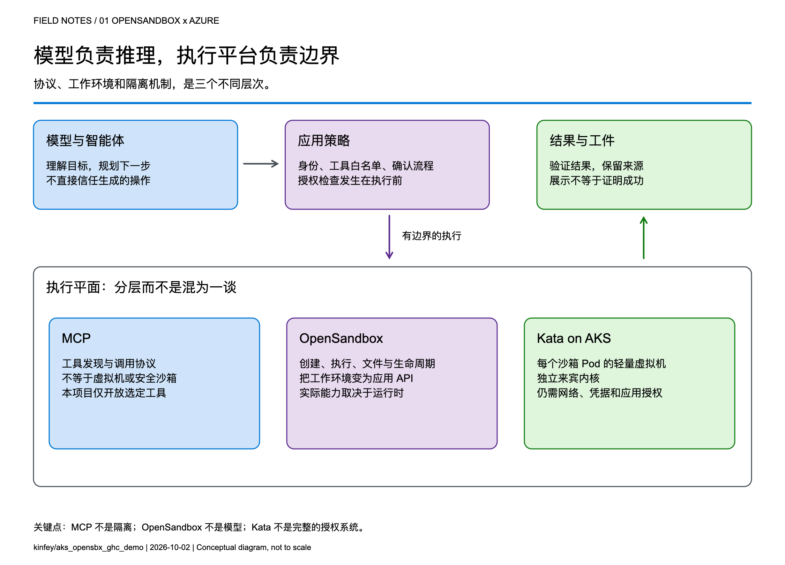
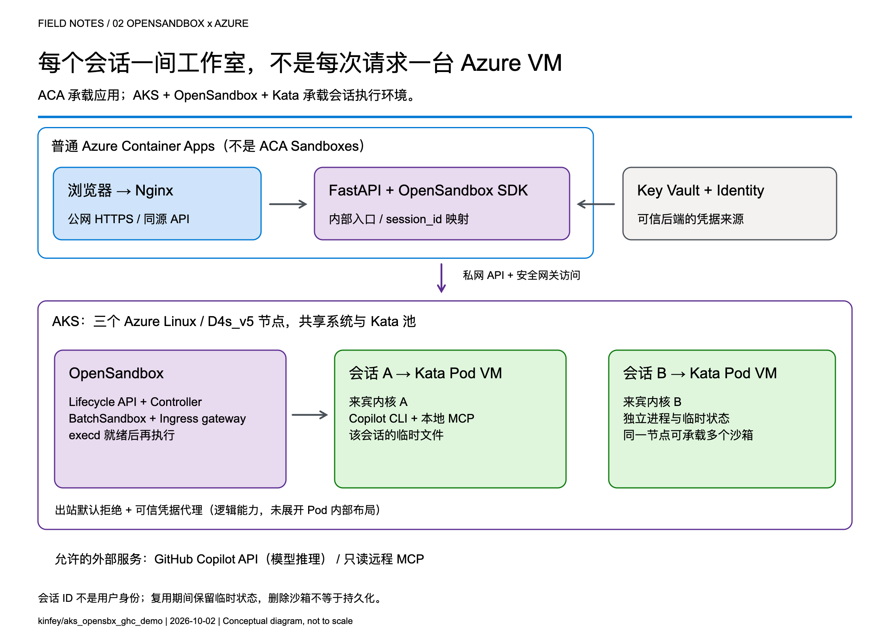
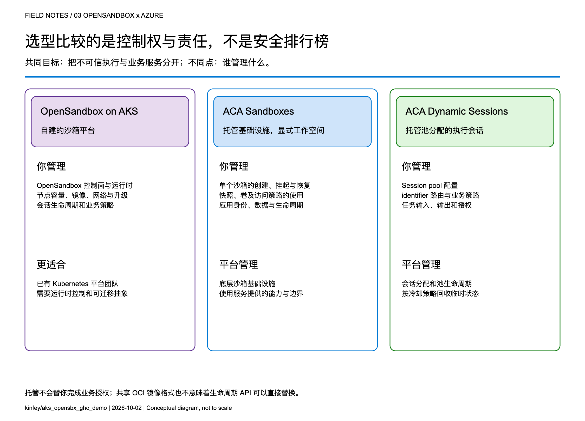
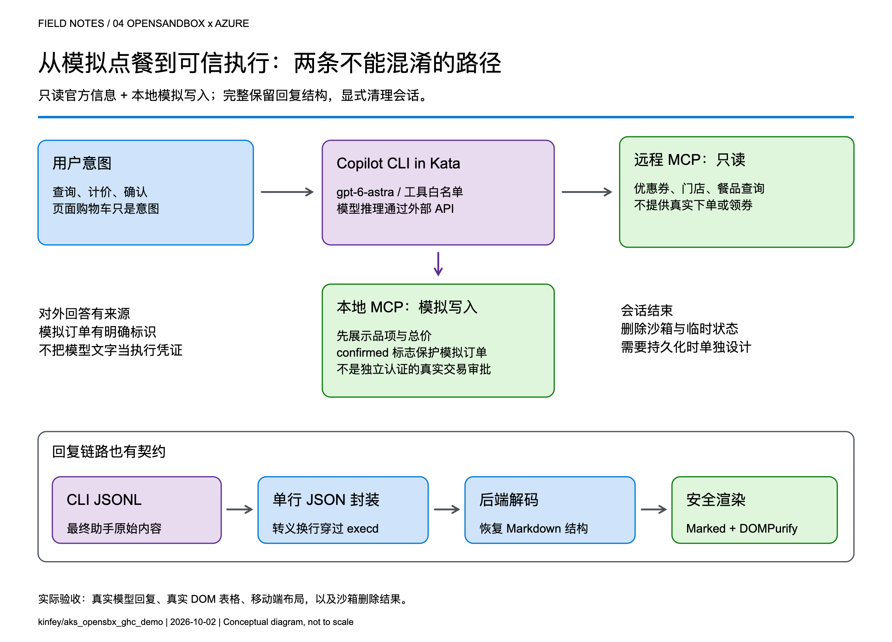

# 当 AI 开始动手：用 OpenSandbox 和 AKS 为 Agent 建立执行边界

**从“每个会话一间工作室”，到 OpenSandbox、ACA Sandboxes 与 Dynamic Sessions 的选型思考**

[Read in English](en.md)

> 撰写与资料核对日期：2026-10-02。本文区分三类内容：官方文档描述的产品能力、示例项目的实际实现与历史验证，以及面向生产的架构建议。本文没有执行 ACA Sandboxes 对照部署，也不是性能基准测试。区域、配额、功能开放和产品阶段应以你部署时的官方信息为准。

## 1. Agent 真正需要的，不只是一个更聪明的模型

假设你正在做一个点餐助手。

第一版，它只回答：“可以考虑汉堡加薯条。”这主要是内容生成问题。第二版，它开始查询优惠券、读取菜单、计算价格、生成文件，甚至调用一个本地程序创建订单。这时，问题已经变了：

**你不再只是让模型说话，而是在允许软件代表用户采取行动。**

这也是我在做技术分享时经常强调的分界线：模型能力决定它能想出什么，执行平台决定这些想法可以在哪里、以什么权限、持续多长时间变成现实。

如果把所有 Agent 的工具进程都放在业务 API 所在的容器里，一个会话遗留的文件、异常进程、依赖变更或资源占用，都可能影响其他会话。即使你没有向用户开放任意 Shell，也仍然需要管理 CLI、工具依赖和临时状态的边界。

因此，沙箱不是给模型加一句“请注意安全”。它是一个有生命周期、资源预算和访问策略的工作环境。



*图 1：协议、工作环境与运行时隔离解决不同问题，不能互相替代。*

## 2. 先把三个经常混在一起的概念分开

### MCP：定义怎么调用工具，不负责把工具关进虚拟机

Model Context Protocol 让模型侧应用以一致方式发现和调用工具。但“通过 MCP 调用”并不自动意味着“在安全边界中执行”。

一个 MCP 服务可以运行在开发者电脑上，也可以运行在业务容器、远程服务或独立沙箱里。工具是否允许写入，谁有权调用，以及失败后能否回滚，都需要另外设计。

### OpenSandbox：把工作环境变成应用可操作的资源

OpenSandbox 是一个开源的 Agent 执行环境平台，提供沙箱生命周期、命令执行、文件操作和网络访问等能力。应用可以通过 SDK/API 创建环境、执行任务、读取结果并清理资源；本地可以使用 Docker，集群侧可以使用 Kubernetes。[1]

可以把它理解为“工作室管理系统”：它安排工作室、递送材料、提供操作接口，并在租期结束后回收。但工作室的墙有多厚，取决于底层运行时及部署方式。

**OpenSandbox 不是大语言模型，不是 Kubernetes 的替代品，也不是天然等同于 Kata 的一个产品。**

上游还有资源池、不同运行时以及快照等能力。具体能否使用、保存哪些状态、需要什么基础设施，应按版本和运行时分别核对，不能把整个项目的能力清单理解为每个后端都具有相同语义。[1], [5]

### Kata：为沙箱 Pod 增加独立来宾内核

传统容器通常共享宿主机内核。Kata Containers 则让工作负载运行在轻量虚拟机中，以虚拟机边界增强隔离。在 AKS Pod Sandboxing 中，隔离单位是使用 Kata 运行时的 **Pod**，每个这样的 Pod 有自己的来宾内核。[2], [3]

这并不是说同一 Pod 中的每个容器都拥有独立虚拟机，也不是说虚拟机就能替代应用认证、出站限制或业务审批。

如果用一句话总结：

> **MCP 定义工具接口，OpenSandbox 管理工作环境，Kata 提供运行时隔离；应用仍然负责授权与业务规则。**

## 3. “Per-session Kata VM”到底在隔离什么？

我们项目里的会话按 `session_id` 识别。后端为新会话创建 OpenSandbox 沙箱，沙箱 Pod 指定 Kata RuntimeClass；同一会话的后续请求复用这个环境。

这意味着：

- **不是每条消息新建一台虚拟机。** 连续对话可复用工具进程产生的文件及临时状态。
- **不是每个用户购买一台 Azure VM。** Kata Pod VM 运行在 AKS 节点上，多个沙箱可以共享一个节点的物理计算资源。
- **不是一台节点只能跑一个沙箱。** 真正的容量取决于资源配置、虚拟机开销、系统组件和并发工作量。
- **不是“有 session ID 就有用户隔离授权”。** ID 是路由和资源映射标识；生产环境必须验证会话归属。

我喜欢用一个比喻：AKS 是园区，节点是楼，Kata 沙箱是工作室，OpenSandbox 是管理工作室的系统。用户在一个会话中反复使用同一间工作室，离开后由系统按策略清场。

这里的“清场”也很重要：临时文件能在会话中保留，不代表它们在沙箱删除后仍然存在。需要长期保存的订单、代码产物或审计记录，应显式写入受治理的持久存储。



*图 2：本项目使用普通 ACA 承载前后端，使用 AKS 承载 OpenSandbox 与 Kata。图中的外部模型通过 API 调用，不在 AKS 节点上部署。*

## 4. 在 AKS 上用 OpenSandbox：安装不是终点，证明边界才是

Kubernetes 提供调度与声明式资源管理，OpenSandbox 把这些资源包装成应用可消费的沙箱接口。

本项目的执行链路是：

1. FastAPI 后端通过 OpenSandbox SDK 请求创建沙箱。
2. 生命周期服务创建 `BatchSandbox` 资源。
3. 控制器把资源声明协调成沙箱 Pod。
4. Pod 使用 Kata 运行时启动。
5. SDK 经由网关访问沙箱内的 execd，完成命令和文件操作。
6. 会话删除或超时后，回收沙箱资源。

上游 Kubernetes 控制器还支持池分配等模式；**这个示例的镜像预热，不等于已经部署了一套可随时分配的沙箱实例池**。缓存镜像与保有 Ready 的空闲沙箱，是两种不同的延迟优化。[5]

### 4.1 用声明指定运行时，用实际检查证明它运行了

项目的 BatchSandbox Pod 模板中，关键片段是：

```yaml
spec:
  runtimeClassName: kata-vm-isolation
  nodeSelector:
    kubernetes.azure.com/kata-vm-isolation: "true"
  securityContext:
    seccompProfile:
      type: RuntimeDefault
```

这是 [Pod 模板](../k8s/opensandbox/batchsandbox-template-configmap.yaml)的片段，不是可以脱离集群前置条件独立运行的完整清单。

该示例实际采用单个共享系统/Kata 节点池：三个 `Standard_D4s_v5`、Azure Linux、`KataVmIsolation`，通过 AKS API `2026-07-01` 创建。模型是通过 GitHub Copilot API 使用的 `gpt-6-astra`，这不是 GPU 模型服务部署。

为了避免“配置里写了 Kata，所以就认为安全”的误判，我们检查实际节点池属性、三个 Ready 节点、RuntimeClass，并在临时 Kata Pod 中检查来宾内核。内核检查是部署验收信号，**不是对整个系统安全性的形式化证明**。

也必须交代一个容易被误读的部署经验：该项目记录过特定订阅在相关网络功能仍为 `Pending` 时，通过所选 API/机型组合完成验证和部署。与此同时，查阅时的 AKS 官方文档仍要求注册 `Microsoft.Network/AllowBringYourOwnPublicIpAddress`。[3]

两者不能推导出“所有订阅都可以忽略注册要求”。重现时应遵循当前官方支持要求；如果实际行为不一致，应向 Azure 确认，而不是把一次观测写成绕过前置条件的通用教程。

### 4.2 自建平台获得控制权，也接下了责任

选择 OpenSandbox on AKS，你能控制运行时、镜像、网络布局和应用对接方式。但节点容量、镜像供应链、控制面升级、资源预算、日志、故障恢复和临时管理员权限的回收，也不会凭空消失。

本项目为了演示简洁，使用共享系统/Kata 池，没有把三个节点包装成高可用保证。生产环境是否需要独立系统池、工作负载池、可用区、配额及更严格的租户隔离，应重新设计，而不是照抄演示规模。

### 4.3 凭据应该能够被使用，而不是被随手读取

Credential Vault 是这个项目中值得单独讲的能力：可信后端把凭据和绑定交给 OpenSandbox 的出站侧车，Copilot 工作负载进程只拿到占位值。允许的 HTTPS 请求通过代理时，才注入相应认证头。[4]

这里要精确用词：**它降低的是工作负载直接获得长期凭据的风险，不是让凭据从整个系统中消失。** 后端和出站侧车仍在可信计算基中；不能据此宣称整个 Pod VM 内绝不存在真实凭据。

同样，不让模型读取令牌，也不代表它不能滥用令牌所授予的操作。项目仍限制远程工具为只读，并对注入目标使用精确主机绑定。生产环境还应缩小操作、路径、租户和数据范围。

上游文档还特别说明：Kubernetes 暂停/恢复导致侧车重建后，内存中的 Vault 内容需要由可信端重新配置。[4] 这提醒我们：**恢复计算状态、恢复身份上下文、恢复业务权限，是三个不同问题。**

## 5. 对比 ACA Sandbox 前，先别把它当作 Dynamic Sessions 的别名

“ACA”指 Azure Container Apps。但它包含多种计算形态：

| 形态 | 主要关注点 |
|------|------------|
| 普通 Container Apps | Web、API、持续运行的服务及其副本扩缩容 |
| Jobs | 启动、运行、完成的任务 |
| Dynamic Sessions | 通过 Session Pool 和标识符获取隔离执行会话 |
| Sandboxes | 对单个隔离环境进行显式生命周期、状态及策略管理 |

当前官方概览把 **ACA Sandboxes** 描述为独立的资源模型：顶层是 `Microsoft.App/SandboxGroups`，组内管理沙箱、磁盘镜像、快照、卷等资源。官方文档列出了挂起/恢复、内存与磁盘状态、端口、出站策略以及 Azure Blob/Data Disk 卷等能力。[6]

实际接入也有自己的控制面契约：通过 ARM 管理 Sandbox Group，通过 Sandboxes 数据面管理具体实例和文件等资源。官方要求 Microsoft Entra ID 身份，以及用于沙箱管理的 `Container Apps SandboxGroup Data Owner` 角色；应在适当范围授予，而不是默认扩大权限。这些是平台访问条件，仍不能替代你的应用对最终用户的认证和授权。[6]

Dynamic Sessions 的核心则是 **Session Pool + identifier**：池分配会话，把后续请求路由到该会话，并按生命周期/冷却策略回收。它可以在会话存续期间保留上下文，不能简单说成“每个请求都完全无状态”；但不应把它等同于具备显式快照和卷管理的工作空间。[7], [8]

还有一个时间边界：查阅时，Microsoft Learn 已描述上述 Sandboxes 能力，而微软仓库中的早期文档仍带有 **Early Access** 标记，并提醒早期资源可能需要重建。[9] 本文不因此推断所有区域/订阅均已 GA，也不把旧文档中的“SDK coming soon”当作现状。实际接入前应核对开放状态、SDK、RBAC、网络选项与服务条款。



*图 3：这不是安全等级或性能排名，而是操作对象和运维责任的分配。*

### 5.1 真正有用的比较表

| 维度 | OpenSandbox on AKS（本项目路径） | ACA Sandboxes | ACA Dynamic Sessions |
|------|-------------------------------|---------------|----------------------|
| 主要对象 | OpenSandbox 沙箱、Kubernetes 工作负载 | Sandbox Group 与单个 Sandbox | Session Pool 与 identifier |
| 平台运维 | 团队维护 OpenSandbox 部署及 AKS 工作负载/节点配置；AKS 控制平面仍由 Azure 托管 | Azure 托管底层服务，应用显式管理沙箱生命周期 | Azure 管理池分配与会话生命周期 |
| 隔离 | 本项目显式选择 Kata Pod VM | 服务文档描述独立安全边界；不在本文猜测其等同于哪种开源运行时 | 官方明确描述 Hyper-V 隔离 |
| 状态 | 本项目采用会话内临时状态；上游其他持久化/快照能力需单独配置并验证 | 显式挂起、恢复、快照和卷 | 会话存续期间保留上下文，回收后按临时状态处理 |
| 镜像与工具 | 自定义镜像、CLI、MCP、运行时策略 | OCI 镜像转换为沙箱根文件系统；需验证具体工作负载兼容性 | 内置解释器或自定义容器池 |
| 网络与凭据 | 团队组合私网、出站策略、Vault 与应用授权 | 使用服务的网络、身份及策略能力；不能假设与 OpenSandbox Vault 等价 | 使用池提供的访问与网络控制，应用负责身份和工具授权 |
| 启动体验 | 取决于镜像缓存、调度、运行时与初始化；本示例没有瞬时启动保证 | 文档描述预热支持的亚秒级启动/恢复，应在自己的镜像和负载下测量 | 文档描述预热池的低延迟分配，应区分池内可用容量与冷启动 |
| 更适合的团队 | 已有 Kubernetes 平台能力，需要更深运行时控制 | 希望托管基础设施，同时显式控制工作空间状态 | 主要需要托管执行会话，不想操作每个环境的完整生命周期 |

表中的 ACA 能力来自官方文档，而不是本项目实测。[6], [7], [8]

**共享 OCI 镜像格式，不代表 SDK/API 可以直接替换。** 现有后端依赖 OpenSandbox 的创建、命令日志、健康检查、凭据代理和删除语义。迁移到 ACA Sandboxes 时，应逐项映射并验证，而不是只换一个 URL。

成本也不应只比较“一个小时多少钱”。更有用的指标是每个成功完成任务的总成本：执行资源、预热容量、状态存储、镜像、网络、日志、模型消耗和运维时间。ACA 文档说明停止的沙箱不收 CPU/内存费用，并不意味着整个应用、存储及依赖服务的账单归零；AKS 上删掉沙箱也不会自动取消固定节点费用。[6]

## 6. 我会怎样根据场景做选择？

### 场景 A：上传 CSV，让 AI 执行短时分析

如果需求是短任务、内置运行时可以满足、状态可以在任务完成后丢弃，我会优先评估 Dynamic Sessions，先减少平台工作量。生成的代码仍应被当作不可信输入，下载结果也需要内容和权限检查。

### 场景 B：一个跨多轮、跨时间段工作的编程 Agent

它可能要保留依赖、代码目录和运行状态，用户离开后希望暂停，回来继续。ACA Sandboxes 的显式生命周期值得优先验证。与此同时，必须决定哪些数据可进入快照，恢复后凭据如何重新授权，以及删除策略如何满足业务要求。

### 场景 C：企业已经有成熟的 AKS 平台

如果团队需要复用 Kubernetes 治理、控制运行时、管理自定义工具链，或者希望围绕统一沙箱 API 构建自己的平台，OpenSandbox on AKS 很有吸引力。这里的收益是控制权和组合能力，不是“开源就没有运维成本”。

### 场景 D：只需要查询一个已治理的业务 API

如果没有代码执行、本地工具进程或临时文件环境的需求，未必需要每个用户一个沙箱。普通 ACA API 加身份认证、服务端权限检查和明确的工具网关，可能更简单。**不是每个 Agent 都需要一套沙箱平台。**

最后，不必把 ACA 与 AKS 视为二选一。我们的项目恰好使用普通 ACA 承载轻量 Web/API，使用 AKS 承载沙箱执行平面。未来也可以让不同任务路由到不同执行后端，但前提是把身份、生命周期、结果和错误处理契约设计清楚。

## 7. 回到真实项目：一个“不真实下单”的点餐助手

项目地址：[kinfey/aks_opensbx_ghc_demo](https://github.com/kinfey/aks_opensbx_ghc_demo)。

这是一个非官方的麦当劳主题技术演示，不代表官方服务，也不提供真实交易。它的价值不在于“AI 会推荐汉堡”，而在于把几种边界放进一个容易理解的业务故事：

- **应用边界：**公网 Nginx 前端，内部 FastAPI 后端。
- **执行边界：**每会话 OpenSandbox + Kata，运行 Copilot CLI 和本地 MCP。
- **操作边界：**远程 MCP 仅开放选定的只读查询；创建订单只发生在本地模拟工具中。
- **凭据边界：**CLI 使用占位值，由可信出站代理对允许请求注入认证信息。
- **展示边界：**模型回复保持原始 Markdown，并在前端净化后渲染。



*图 4：查询官方信息与写入模拟订单是两条不同路径，不能因为出现在同一段对话里就混淆。*

### 7.1 一段合理的交互应该如何展开？

以下是流程示意，不是杜撰的线上会话记录：

1. 用户说：“看看当前优惠，再帮我算一份模拟套餐。”
2. 后端创建或复用该会话的沙箱。
3. Copilot 对官方优惠问题调用只读远程 MCP，而不是编造优惠。
4. 模拟套餐通过本地 `get_menu`、`calculate_order` 计价；模拟价格与官方报价明确区分。
5. 助手展示品项和总价，请用户确认。
6. 只有确认后，才调用本地 `create_order`，生成明确标识为模拟的订单。
7. 用户结束会话或达到空闲阈值后，清理沙箱；模拟订单文件不作为长期业务记录保留。

工具实现会拒绝 `confirmed=false`。但布道时也应讲清它的边界：由 Agent 传入的布尔值，不是独立认证、可审计的真实交易审批系统。若要做真实订单，确认必须升级为服务端可验证、绑定用户与具体订单内容的业务授权机制。

当前后端的会话映射在内存中，副本数限制为一个，也没有公共用户登录与会话归属认证。这是演示约束，不是多租户生产模板。[10]

### 7.2 这次落地教会我们的三件事

**第一件：启动时间不是一个数字。**

项目首次拉取约 2.8 GB 的沙箱镜像，曾花费接近六分钟。那次等待不是模型推理慢，也不能直接归因于 Azure 功能审批。我们把镜像预热放到用户请求路径之外，并等待实际 execd 健康检查。

```text
端到端延迟 =
  排队/调度 + 镜像拉取 + 来宾环境启动 + 证书/代理初始化
  + CLI 启动 + 模型与工具调用 + 结果传输和渲染
```

这就是为什么不能拿服务宣传中的“预热后亚秒分配”，直接和本项目一次冷镜像拉取作性能比较。对比时应固定镜像、缓存状态、并发、区域和测量边界，再观察分位数、失败率及每成功任务成本。

**第二件：隔离环境跑通了，数据契约仍可能坏掉。**

我们曾遇到“网页已经支持 Markdown，真实回复却没有表格”的问题。原因不在 CSS：

- Copilot 默认终端输出已经把 Markdown 表格变成字符边框。
- execd 的逐行日志又丢掉了非空行结尾的换行符。

最终，包装程序读取 CLI JSONL 中的原始助手内容，用单行 JSON 封装穿过命令日志，后端再解码出完整 Markdown。前端使用 Marked 与 DOMPurify，既保留表格、标题和代码，也不把任意模型 HTML 直接插入页面。

**第三件：验收必须覆盖真实路径。**

固定回复的浏览器测试只能证明渲染器会工作，不能证明模型、CLI、日志和 API 之间的数据没有损坏。项目后续增加了真实模型测试，检查 API 原始 Markdown、真实 DOM 表格和移动端布局，并确认沙箱删除结果。[11]

远程工具是否运行，也应看工具执行事件，不能仅凭模型回复“我已经查询了”。这些都属于同一个工程原则：**用实际副作用和结构化结果证明完成，不用一句成功文案代替。**

## 8. 如果把这个演示推进生产，我会先补什么？

我不会先增加更多工具，而会先补齐五个问题：

| 问题 | 应做的设计 |
|------|------------|
| 谁拥有这个会话？ | 登录身份、租户绑定、服务端会话归属检查和资源授权 |
| 哪些状态值得保留？ | 会话临时目录、持久工件、业务订单和审计记录分开管理 |
| 谁有权产生副作用？ | 用户确认、订单内容绑定、幂等性和可审计审批，不依赖模型自我约束 |
| 系统会在哪里失效？ | 启动分阶段指标、并发准入、预算、超时、重试和资源回收 |
| 能否换执行后端？ | 对创建、执行、文件、凭据、状态恢复和删除语义做契约测试 |

在最后一项上，ACA Sandboxes 是值得验证的替代执行后端；但这应是有测量、有身份设计的迁移实验，而不是未经验证的“无缝替换”承诺。

## 结语：真正的 Agent 平台，是把能力放在边界里

OpenSandbox 给了应用一个管理执行环境的抽象，AKS 与 Kata 让我们能够把这个抽象落到可观察、可配置的基础设施上。ACA Sandboxes 和 Dynamic Sessions 则提供不同层次的托管选择，让团队不必承担完全相同的平台责任。

我更愿意把这道选型题改写成三个问题：

**我们需要控制什么？我们愿意维护什么？我们怎样证明一次执行真的按预期完成？**

回答清楚这三个问题，比简单争论“自建还是 Serverless”更有价值。一个可靠的 AI 应用，既需要足够聪明的模型，也需要一间边界清楚、可以回收、能够审计的工作室。

---

## 延伸阅读与资料边界

- 完整部署步骤：[简体中文 README](../README.zh.md)。
- 可运行源码：[项目仓库](https://github.com/kinfey/aks_opensbx_ghc_demo)。
- 本文四组配图均为原创技术示意图；`imgs/` 提供中英文 PNG、可缩放 SVG 及同名 `.excalidraw` 编辑源文件。图片不是性能数据，也不代表云产品认证。
- 全文使用通用资源描述。若重现部署，`AZURE_RESOURCE_GROUP`、`AKS_NAME` 及其他配置必须填写自己的值。

### 官方资料

1. [OpenSandbox：定位、SDK、运行时与示例][1]
2. [Kata Containers：轻量虚拟机隔离][2]
3. [AKS Pod Sandboxing：运行时、前置条件和限制][3]
4. [OpenSandbox Credential Vault：凭据代理及恢复语义，固定提交][4]
5. [OpenSandbox Kubernetes Operator：BatchSandbox、Pool、快照，固定提交][5]
6. [Azure Container Apps Sandboxes 概览][6]
7. [Azure Container Apps Dynamic Sessions 概览][7]
8. [Dynamic Sessions 与 Sandboxes 的官方对比][8]
9. [微软仓库中的 ACA Sandboxes Early Access 文档][9]
10. [本项目：会话管理及运行时边界][10]
11. [本项目：真实回复端到端浏览器测试][11]

[1]: https://github.com/opensandbox-group/OpenSandbox
[2]: https://github.com/kata-containers/kata-containers
[3]: https://learn.microsoft.com/en-us/azure/aks/use-pod-sandboxing
[4]: https://github.com/opensandbox-group/OpenSandbox/blob/3738975fc7b1da6875694f912b0422fe5d622064/docs/guides/credential-vault.md
[5]: https://github.com/opensandbox-group/OpenSandbox/blob/3738975fc7b1da6875694f912b0422fe5d622064/docs/architecture/control-plane/operator.md
[6]: https://learn.microsoft.com/en-us/azure/container-apps/sandboxes-overview
[7]: https://learn.microsoft.com/en-us/azure/container-apps/sessions
[8]: https://sandboxes.azure.com/docs/sandboxes/dynamic-sessions-vs-sandboxes
[9]: https://github.com/microsoft/azure-container-apps/blob/main/docs/early/sandboxes-overview.md
[10]: https://github.com/kinfey/aks_opensbx_ghc_demo/blob/c75a35b/src/backend/app/sandbox_manager.py
[11]: https://github.com/kinfey/aks_opensbx_ghc_demo/blob/c75a35b/src/frontend/tests/real-reply.spec.js
