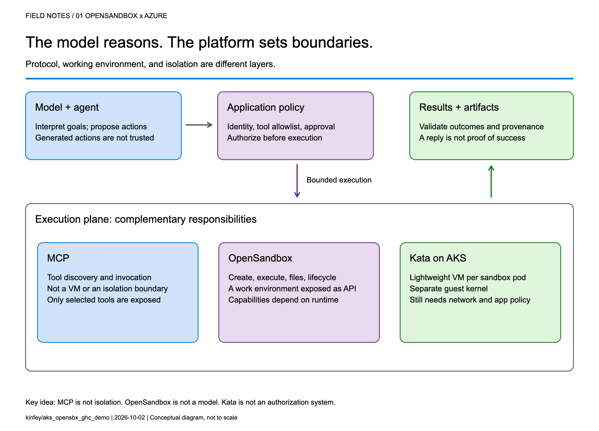
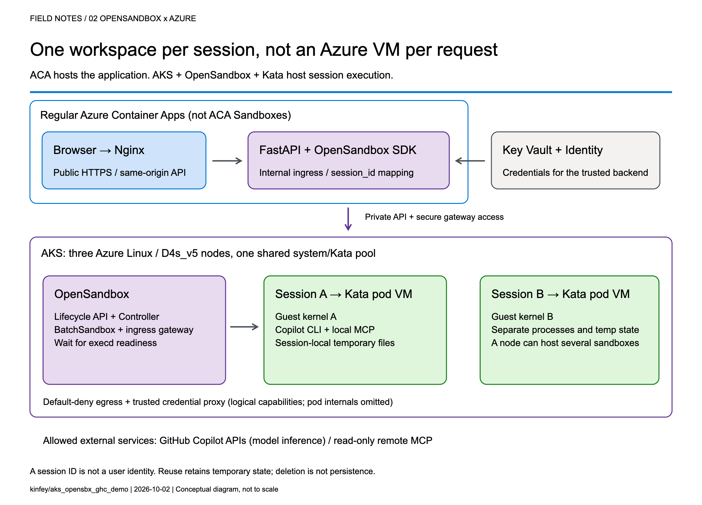
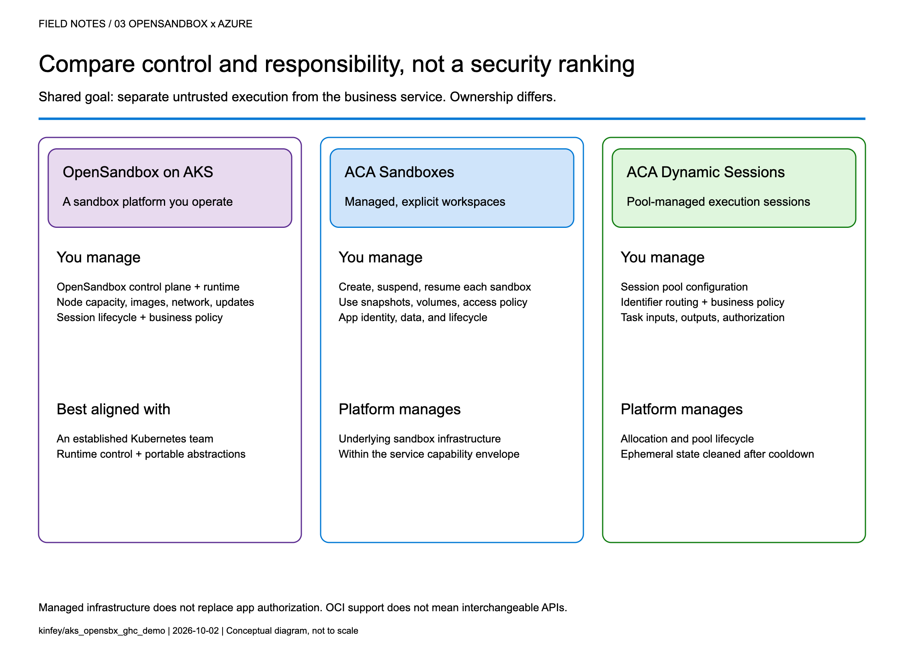
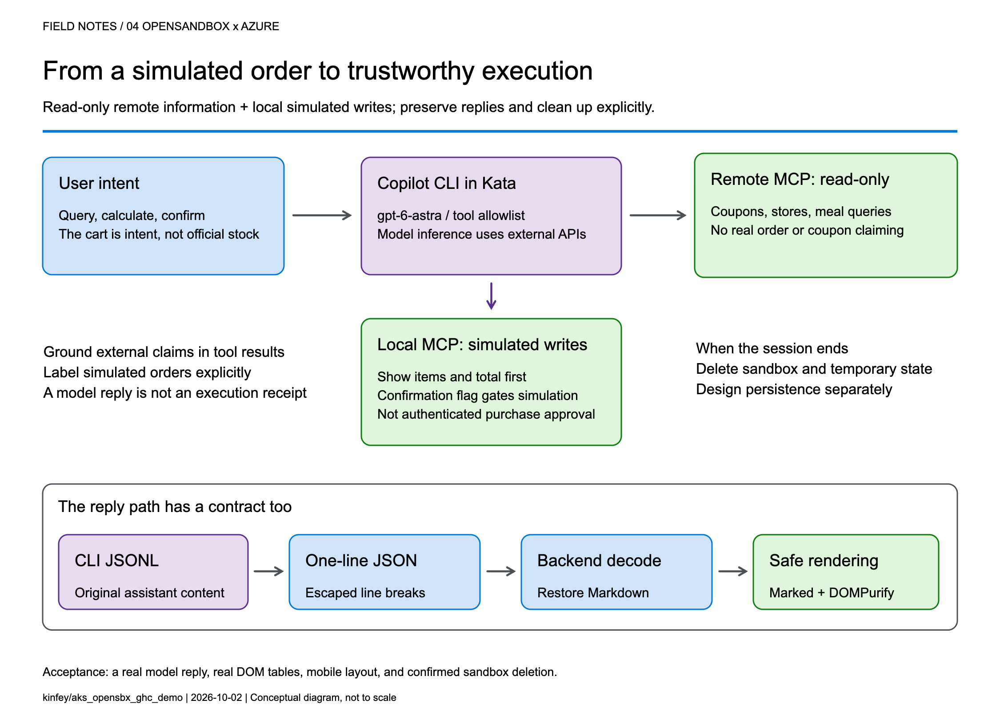

# When AI Starts Taking Action: Building Execution Boundaries with OpenSandbox and AKS

**From a workspace per session to choosing between OpenSandbox, ACA Sandboxes, and Dynamic Sessions**

[阅读简体中文版](cn.md)

> Written and sources checked on 2026-10-02. This article distinguishes documented product capabilities, the sample project's implementation and historical verification, and recommendations for production. It does not report an ACA Sandboxes deployment or a comparative benchmark. Check current regional availability, quotas, access requirements, and release status before deploying.

## 1. An agent needs more than a smarter model

Imagine you are building a food-ordering assistant.

In its first version, it says, “You might enjoy a burger and fries.” That is primarily a content-generation problem. In the next version, it queries coupons, reads a menu, calculates prices, creates files, and calls a local program to create an order.

The engineering problem has changed. **You are no longer asking a model to speak. You are allowing software to act on someone's behalf.**

This is a distinction I emphasize in technical talks: model capability determines what the agent can propose; the execution platform determines where, with which permissions, and for how long those proposals can become actions.

Running every agent's tool processes inside the business API container creates awkward coupling. Leftover files, stuck processes, dependency changes, or excessive resource consumption from one session can affect another. Even if customers cannot invoke an arbitrary shell, CLI processes, tool dependencies, and temporary state still need boundaries.

A sandbox is therefore not an instruction that says “please be safe.” It is a working environment with a lifecycle, a resource budget, and an access policy.



*Figure 1. A tool protocol, a working environment, and runtime isolation solve different problems.*

## 2. Separate three concepts that often get conflated

### MCP describes tool interaction; it does not put tools inside a VM

The Model Context Protocol gives model-facing applications a consistent way to discover and invoke tools. But “called through MCP” does not automatically mean “executed within a security boundary.”

An MCP server can run on a developer's laptop, in a business-service container, remotely, or in a dedicated sandbox. Whether a tool can write data, who may invoke it, and how its side effects can be reversed are separate design questions.

### OpenSandbox makes the working environment an application resource

OpenSandbox is an open-source platform for agent execution environments. It exposes sandbox lifecycle, command execution, file operations, and network-access capabilities. Applications use SDKs and APIs to create environments, run work, retrieve results, and clean up. Docker supports a local starting point; Kubernetes provides a cluster deployment path.[1]

Think of it as a workspace management system: it allocates a room, delivers materials, exposes ways to work, and reclaims the room at the end of its lease. The strength of the walls depends on the runtime and deployment underneath.

**OpenSandbox is not a language model, not a replacement for Kubernetes, and not synonymous with Kata.**

The upstream project also provides pools, multiple runtime paths, and snapshot-related capabilities. Availability, state semantics, and infrastructure requirements must be checked against the selected version and runtime. A project-wide feature list is not a promise that every backend behaves identically.[1], [5]

### Kata adds a separate guest kernel to the sandbox pod

Conventional containers generally share the host kernel. Kata Containers runs workloads in lightweight virtual machines, adding a VM boundary. With AKS Pod Sandboxing, the isolation unit is the **pod** using the Kata runtime, with its own guest kernel.[2], [3]

That does not mean every container in the same pod gets its own VM. Nor does a VM replace application authentication, outbound restrictions, or business approvals.

The useful summary is:

> **MCP defines the tool interface. OpenSandbox manages the working environment. Kata provides runtime isolation. The application still owns authorization and business rules.**

## 3. What does “per-session Kata VM” actually isolate?

In this project, a session is identified by `session_id`. The backend creates an OpenSandbox sandbox for a new session, and its pod selects the Kata RuntimeClass. Later requests in the same session reuse that environment.

Several distinctions matter:

- **It is not a new VM for every message.** Related turns can reuse files and temporary state produced by the tools.
- **It is not an Azure VM purchased for every user.** Kata pod VMs run on AKS nodes; multiple sandboxes can share a node's underlying compute resources.
- **It is not one sandbox per node.** Capacity depends on resource settings, VM overhead, system components, and concurrent work.
- **A session ID is not authorization.** It identifies routing and resource mappings; production services must validate session ownership.

My favorite analogy is a campus: AKS is the campus, nodes are buildings, Kata sandboxes are workrooms, and OpenSandbox is the workspace management system. A session repeatedly uses the same room; a lifecycle policy eventually clears it.

That final step matters. Files surviving between turns does not mean they survive sandbox deletion. Orders, code artifacts, or audit records that must outlive the environment need explicit, governed persistence.



*Figure 2. This project hosts its frontend and backend in regular ACA, and OpenSandbox/Kata on AKS. Model inference is called through an external API, not hosted on the AKS nodes.*

## 4. OpenSandbox on AKS: installation is not the finish line

Kubernetes supplies scheduling and declarative resource management. OpenSandbox turns that infrastructure into sandbox operations that an application can consume.

The execution path in this project is:

1. The FastAPI backend requests a sandbox through the OpenSandbox SDK.
2. The lifecycle service creates a `BatchSandbox` resource.
3. The controller reconciles that declaration into a sandbox pod.
4. The pod starts with the Kata runtime.
5. The SDK accesses execd through the gateway for command and file operations.
6. Deletion or expiration reclaims the sandbox.

The upstream Kubernetes operator also supports pool allocation. However, **warming an image in this sample is not the same as maintaining a ready-to-allocate pool of sandbox instances**. Cached image layers and ready idle sandboxes are different latency optimizations.[5]

### 4.1 Declare the runtime, then verify the running boundary

The important part of the project's BatchSandbox pod template is:

```yaml
spec:
  runtimeClassName: kata-vm-isolation
  nodeSelector:
    kubernetes.azure.com/kata-vm-isolation: "true"
  securityContext:
    seccompProfile:
      type: RuntimeDefault
```

This is a fragment of the [pod template](../k8s/opensandbox/batchsandbox-template-configmap.yaml), not a complete manifest that works independently of cluster prerequisites.

The deployed example uses one shared system/Kata pool: three `Standard_D4s_v5` Azure Linux nodes with `KataVmIsolation`, created through AKS API `2026-07-01`. The model is `gpt-6-astra` accessed through GitHub Copilot APIs; this is not a GPU model-serving deployment.

To avoid confusing “Kata appears in the configuration” with “the boundary is working,” deployment checks inspect the actual pool properties, three Ready nodes, the RuntimeClass, and the guest kernel inside a temporary Kata pod. The kernel check is a deployment acceptance signal, **not a formal proof of the entire system's security**.

### 4.2 More platform control also means more platform ownership

OpenSandbox on AKS gives a team control over its runtime, images, network layout, and application integration. It also leaves the team responsible for node capacity, image provenance, control-plane upgrades, resource budgets, observability, recovery, and removal of temporary installation privileges.

For simplicity, this demonstration uses a shared system/Kata pool. Three nodes are not presented as a high-availability guarantee. A production design should reconsider dedicated system and workload pools, zones, quotas, and tenant separation rather than copy the demonstration's footprint.

### 4.3 Credentials should be usable without being casually readable

Credential Vault is especially interesting here. The trusted backend supplies credentials and bindings to OpenSandbox's egress sidecar. The Copilot workload process receives placeholders; the proxy injects authentication into matching outbound HTTPS requests.[4]

Precision matters: **this reduces the workload's direct access to long-lived credentials; it does not make credentials disappear from the system.** The backend and egress sidecar remain in the trusted computing base. It would be inaccurate to claim that real credentials can never exist anywhere within the pod VM.

Preventing a model from reading a token also does not prevent misuse of operations authorized by that token. This project still restricts remote tools to read-only operations and uses exact hostname bindings for credential injection. Production systems should further scope operations, paths, tenants, and data.

The upstream guide also explains that Kubernetes pause/resume can recreate the sidecar, requiring a trusted client to repopulate its in-memory vault.[4] That distinction is valuable: **restoring compute state, restoring identity context, and restoring business permissions are different operations.**

## 5. Before comparing ACA Sandbox, stop treating it as another name for Dynamic Sessions

Azure Container Apps includes several compute models:

| Model | Primary concern |
|-------|-----------------|
| Regular Container Apps | Web apps, APIs, continuous services, and replica scaling |
| Jobs | Tasks that start, run, and complete |
| Dynamic Sessions | Isolated execution through a session pool and identifier |
| Sandboxes | Explicit lifecycle, state, and policy control over individual environments |

The current official overview describes **ACA Sandboxes** as a distinct resource model. A `Microsoft.App/SandboxGroups` resource is the management boundary for sandboxes, disk images, snapshots, volumes, and related resources. Documented capabilities include suspend/resume, memory and disk state, ports, egress policies, and Azure Blob/Data Disk volumes.[6]

Integration has its own control-plane contract: ARM manages sandbox groups, while the Sandboxes data plane manages individual instances, files, and related resources. The documentation requires a Microsoft Entra ID identity and the `Container Apps SandboxGroup Data Owner` role for sandbox management, assigned at an appropriate scope rather than granting broad access by default. These platform access requirements still do not replace your application's end-user authentication and authorization.[6]

Dynamic Sessions centers on **Session Pool + identifier**. A pool allocates a session, routes related requests to it, and reclaims it according to lifecycle and cooldown settings. Context can survive while that session exists; calling it “completely stateless per request” would be misleading. But it is not the same abstraction as a workspace with explicit snapshot and volume management.[7], [8]

There is also a release-status caveat. At the time of review, Microsoft Learn described these Sandboxes capabilities, while Microsoft's earlier repository documentation still carried an **Early Access** label and warned that early resources might need recreation.[9] This article does not infer universal GA or regional access, nor does it treat the older “SDK coming soon” wording as current. Verify access, SDKs, RBAC, networking options, and service terms before adoption.



*Figure 3. This is an ownership comparison, not a security rating or performance ranking.*

### 5.1 A comparison that helps make a decision

| Dimension | OpenSandbox on AKS: this project's path | ACA Sandboxes | ACA Dynamic Sessions |
|-----------|----------------------------------------|---------------|----------------------|
| Main object | OpenSandbox sandbox and Kubernetes workload | Sandbox group and individual sandbox | Session pool and identifier |
| Platform operations | Team operates OpenSandbox and configures AKS workloads/nodes; Azure still manages the AKS control plane | Azure manages underlying infrastructure; the app explicitly manages sandbox lifecycle | Azure manages pool allocation and session lifecycle |
| Isolation | This project explicitly selects Kata pod VMs | Documented independent security boundary; this article does not infer a particular open-source runtime | Officially documented Hyper-V isolation |
| State | Temporary per-session state here; upstream persistence/snapshot paths need separate configuration and validation | Explicit suspend, resume, snapshots, and volumes | Context while a session exists; treat state as ephemeral after reclamation |
| Images and tools | Custom images, CLI, MCP, and runtime policy | OCI images converted to root filesystems; validate workload compatibility | Built-in interpreters or custom container pools |
| Network and credentials | Team combines private networking, egress policy, Vault, and app authorization | Service identity/network/policy capabilities; do not assume equivalence to OpenSandbox Vault | Pool access and network controls; app owns identity and tool authorization |
| Startup experience | Depends on cache, scheduling, runtime, and initialization; no instant-start guarantee in this sample | Documentation describes prewarmed subsecond startup/restore; measure your own workload | Documentation describes low-latency prewarmed allocation; distinguish spare pool capacity from cold starts |
| Team fit | Kubernetes expertise and a need for deeper runtime control | Managed infrastructure with explicit workspace state control | Managed execution sessions without managing every environment's full lifecycle |

The ACA entries describe documented capabilities, not measurements from this project.[6], [7], [8]

**A shared OCI image format does not make SDKs and APIs interchangeable.** The existing backend depends on OpenSandbox creation, command-log, health, credential-proxy, and deletion semantics. Moving it to ACA Sandboxes requires mapping and testing those contracts, not changing an endpoint URL.

Cost is also more than a price per hour. A useful measure is total cost per successfully completed task: execution resources, warm capacity, state storage, images, networking, logs, model usage, and operational effort. ACA documentation says stopped sandboxes incur no CPU/memory fees; that does not zero the bill for the application, storage, or dependencies. Deleting an AKS sandbox does not eliminate fixed node costs either.[6]

## 6. How I would choose for different scenarios

### Scenario A: upload a CSV and ask AI to run a short analysis

If work is brief, the built-in runtime is sufficient, and state can be discarded afterward, I would evaluate Dynamic Sessions first to reduce platform work. Generated code remains untrusted input, and downloadable outputs still need content and authorization checks.

### Scenario B: a coding agent that works across turns and time

This agent may need dependencies, a source tree, and process state. A user leaves, the environment pauses, and work continues later. ACA Sandboxes' explicit lifecycle is a compelling capability to validate. The design must still decide what may enter a snapshot, how credentials are reauthorized after restore, and how deletion policies meet business obligations.

### Scenario C: an enterprise with an established AKS platform

If a team needs existing Kubernetes governance, runtime control, custom toolchains, or a platform built around a unified sandbox API, OpenSandbox on AKS is attractive. Its benefit is control and composability, not the assumption that open source removes operating costs.

### Scenario D: the agent only calls a governed business API

If there is no generated-code execution, local tool process, or temporary filesystem requirement, a sandbox per user may be unnecessary. A regular ACA API with authentication, server-side permissions, and a well-defined tool gateway can be simpler. **Not every agent needs a sandbox platform.**

These choices are not mutually exclusive. Our project uses regular ACA for the lightweight web/API layer and AKS for the execution plane. Different task classes could eventually use different execution backends, provided identity, lifecycle, results, and error contracts are explicit.

## 7. The concrete example: an ordering assistant that does not place real orders

Project: [kinfey/aks_opensbx_ghc_demo](https://github.com/kinfey/aks_opensbx_ghc_demo).

This is an unofficial McDonald's-themed technical demonstration, not an official service or a real transaction system. Its value is not that AI can recommend a burger. It places several boundaries in an understandable business story:

- **Application boundary:** a public Nginx frontend and an internal FastAPI backend.
- **Execution boundary:** per-session OpenSandbox/Kata running Copilot CLI and local MCP.
- **Operation boundary:** selected read-only remote queries; order creation exists only in local simulation tools.
- **Credential boundary:** placeholders in the CLI workload, with authentication injected for allowed requests by a trusted egress proxy.
- **Presentation boundary:** original Markdown preserved in transit and sanitized before browser rendering.



*Figure 4. Querying external information and writing a simulated order are different paths, even when they appear in the same conversation.*

### 7.1 What should a reasonable interaction look like?

The following is an illustrative workflow, not an invented transcript of a live customer:

1. A user asks, “Check current offers, then calculate a simulated meal.”
2. The backend creates or reuses the session sandbox.
3. Copilot invokes a read-only remote MCP tool for official offers rather than inventing them.
4. Local `get_menu` and `calculate_order` tools price the simulation, clearly distinguished from official quotes.
5. The assistant displays items and the total and asks for confirmation.
6. Only after confirmation does it call local `create_order`, producing an explicitly simulated order.
7. Session completion or the idle policy triggers sandbox cleanup; the order file is not retained as a durable business record.

The tool rejects `confirmed=false`. Its limit should also be clear in any technical presentation: an agent-supplied boolean is not an independently authenticated, auditable purchase-approval system. Real commerce would require server-verifiable authorization bound to a user and the exact order contents.

The current backend keeps session mappings in memory, runs at most one replica, and does not provide public user login or authenticated session ownership. These are demonstration constraints, not a production multitenancy template.[10]

### 7.2 Three lessons from making it work

**First: startup latency is not one number.**

An initial pull of the roughly 2.8 GB sandbox image took almost six minutes. That delay was not slow model inference, and it could not simply be attributed to feature approval. We moved image warmup outside the user request path and waited for actual execd health.

```text
End-to-end latency =
  queue/scheduling + image pull + guest startup + certificate/proxy setup
  + CLI startup + model/tool execution + result transport and rendering
```

This is why a documented subsecond allocation from warm capacity should not be compared directly with one cold image pull in this project. A meaningful evaluation controls the image, cache state, concurrency, region, and measurement boundary, then tracks percentiles, failure rates, and cost per successful task.

**Second: a working isolation boundary does not guarantee a working data contract.**

We encountered a deceptively simple issue: the web renderer supported Markdown, but real replies still had no proper tables. CSS was not the problem:

- Copilot's default terminal output had already converted Markdown tables into character borders.
- Execd's line-oriented logging removed the terminators from nonempty lines.

The fix extracted original assistant content from CLI JSONL, encoded it in a single-line JSON envelope across command logs, and decoded it back into Markdown in the backend. Marked and DOMPurify then preserved tables, headings, and code without inserting arbitrary model-generated HTML directly into the page.

**Third: acceptance must cover the real path.**

A browser test with a fixed reply proves that the renderer works, not that model output survives the CLI, logs, and API. The project added a live-model test that checks raw Markdown, actual DOM tables, mobile layout, and confirmed sandbox deletion.[11]

Similarly, successful remote tool use should be established from tool-execution events, not merely from the model saying “I checked.” The broader engineering rule is the same: **prove completion with structured results and actual side effects, not a success-shaped sentence.**

## 8. What I would add before calling this production

I would not start by adding more tools. I would answer five questions:

| Question | Required design |
|----------|-----------------|
| Who owns the session? | Authentication, tenant binding, server-side session ownership, and resource authorization |
| Which state deserves to survive? | Separate temporary workspace files, durable artifacts, business orders, and audit records |
| Who may cause side effects? | User approval bound to contents, idempotency, and auditable authorization beyond model instructions |
| Where can the system fail? | Stage-level startup metrics, admission control, budgets, timeouts, retries, and resource reclamation |
| Can the execution backend change? | Contract tests for create, execute, files, credentials, state restoration, and deletion |

For the last question, ACA Sandboxes is a worthwhile alternative backend to evaluate. But it should be a measured migration experiment with a deliberate identity design, not an untested promise of a seamless swap.

## Closing thought: an agent platform puts capability inside boundaries

OpenSandbox gives applications an abstraction for working environments. AKS and Kata let a team implement that abstraction on observable, configurable infrastructure. ACA Sandboxes and Dynamic Sessions offer managed alternatives with different levels of operational ownership.

I prefer to rewrite the selection question as three questions:

**What do we need to control? What are we willing to operate? How will we prove that execution completed as intended?**

Those questions are more useful than a simple “self-hosted versus serverless” debate. A reliable AI application needs both a capable model and a workspace with clear boundaries, a reclaimable lifecycle, and an auditable record of what happened.

---

## Further reading and scope

- Full deployment instructions: [English README](../README.md).
- Runnable source: [project repository](https://github.com/kinfey/aks_opensbx_ghc_demo).
- The four diagram sets are original technical illustrations. `imgs/` contains Chinese and English PNGs, scalable SVGs, and matching editable `.excalidraw` files. They are not benchmarks or product certifications.
- Resource descriptions are generic. Supply your own `AZURE_RESOURCE_GROUP`, `AKS_NAME`, and other configuration when reproducing the deployment.

### Sources

1. [OpenSandbox: scope, SDKs, runtimes, and examples][1]
2. [Kata Containers: lightweight VM isolation][2]
3. [OpenSandbox Credential Vault: broker and restore semantics, pinned revision][3]
4. [OpenSandbox Kubernetes operator: BatchSandbox, Pool, snapshots, pinned revision][4]
5. [Azure Container Apps Sandboxes overview][5]
6. [Azure Container Apps Dynamic Sessions overview][6]
7. [Official comparison of Dynamic Sessions and Sandboxes][7]
8. [Microsoft's earlier ACA Sandboxes Early Access documentation][8]
9. [This project: session management and runtime boundaries][9]
10. [This project: real-reply end-to-end browser test][10]

[1]: https://github.com/opensandbox-group/OpenSandbox
[2]: https://github.com/kata-containers/kata-containers
[3]: https://learn.microsoft.com/en-us/azure/aks/use-pod-sandboxing3738975fc7b1da6875694f912b0422fe5d622064/docs/guides/credential-vault.md
[4]: https://github.com/opensandbox-group/OpenSandbox/blob/3738975fc7b1da6875694f912b0422fe5d622064/docs/architecture/control-plane/operator.md
[5]: https://learn.microsoft.com/en-us/azure/container-apps/sandboxes-overview
[6]: https://learn.microsoft.com/en-us/azure/container-apps/sessions
[7]: https://sandboxes.azure.com/docs/sandboxes/dynamic-sessions-vs-sandboxes
[8]: https://github.com/microsoft/azure-container-apps/blob/main/docs/early/sandboxes-overview.md
[9]: https://github.com/kinfey/aks_opensbx_ghc_demo/blob/c75a35b/src/backend/app/sandbox_manager.py
[10]: https://github.com/kinfey/aks_opensbx_ghc_demo/blob/c75a35b/src/frontend/tests/real-reply.spec.js
